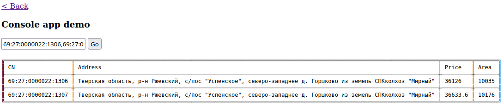

# Установка
1) Создаем папку и заходим в нее
`mkdir mgdemo; cd mgdemo`
2) Клонируем в созданную папку 
`git clone git@github.com:tebazil/moigektar-tz.git .`
3) Устанавливаем зависимости 
`composer install`
4) Правим `config/db.php`, устанавливаем свои данные БД 
5) Применяем миграции
`./yii migrate`
6) Запускаем встроенный сервер php (пример) `php -S localhost:8000 -t ~/mgdemo/web`
   
# Проверка работы
1) По адресу http://localhost:8000 должно открываться тестировочное меню из ссылок на приложения   

2) По запросу ./yii service/run 1:1 должно выбросить исключение, что кадастровый номер не валиден

# Использование приложения
## Кадастровые номера для проверки
*Валидные и есть в апи:*   
69:27:0000022:1306   
69:27:0000022:1307   
*Валидные и нет в апи:*   
69:27:0000022:1308   
*Невалидные:*   
1:1 или любой другой невалидный  
   
Для любого приложения можно вводить несколько кадастровых номеров через запятую   
Общий проверочный адрес веб-интерфейса: `http://localhost:8000`

## Консольное приложение
`./yii service/run 69:27:0000022:1306,69:27:0000022:1307`   
  
   
или  
`http://localhost:8000/console` (через веб-интерфейс)   
 
## Rest приложение
`http://localhost:8000/rest/plots?cadastreNumbers[]=69:27:0000022:1306&cadastreNumbers[]=69:27:0000022:1307`   
или   
`http://localhost:8000/rest/plots?cadastreNumbers=69:27:0000022:1306,69:27:0000022:1307` (через запятую)  
   
  
или   
`http://localhost:8000/rest` (через веб-интерфейс)   
  
## Веб приложение
`http://localhost:8000/web`   
 

